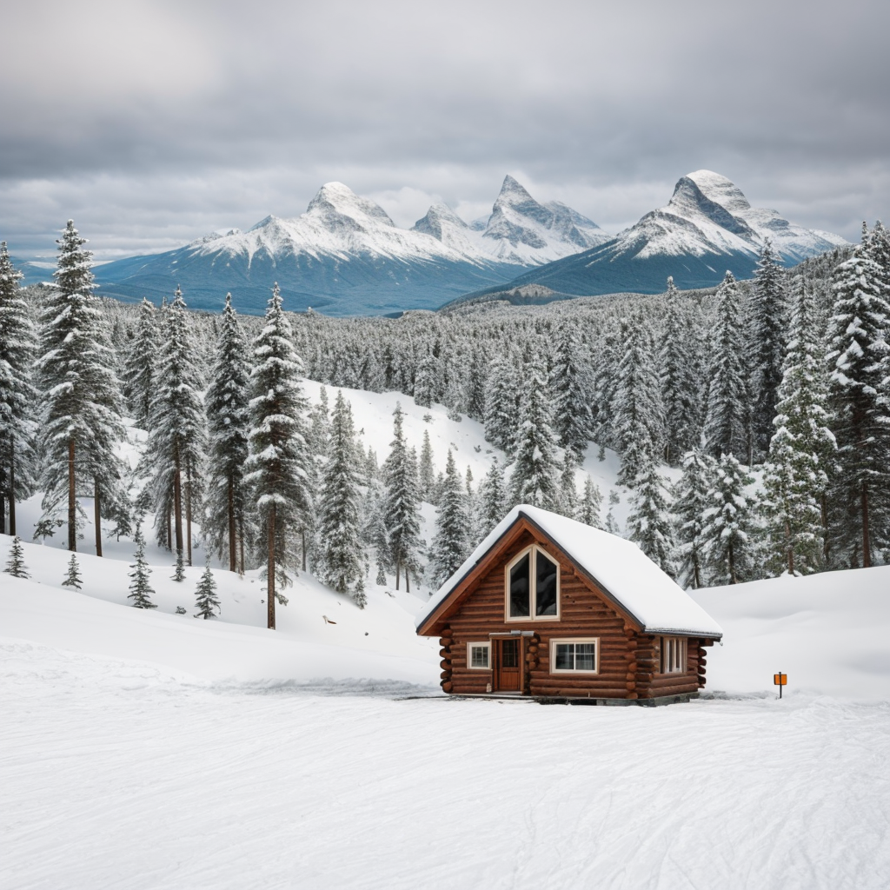

# IA na Cultura Visual Moderna

Este projeto explora como a inteligência artificial está influenciando a criação de imagens e a cultura visual de hoje. Usando tecnologias como ChatGPT e Stable Diffusion, as imagens neste repositório são criadas a partir de descrições detalhadas, mostrando como a IA pode fazer arte visual realista e inspiradora.

## Sobre o Projeto

As imagens apresentadas aqui mostram diferentes cenários e temas, oferecendo uma visão única de como humanos e inteligência artificial colaboram para criar novas formas de arte visual.

## Tecnologias Usadas

* **ChatGPT** : Cria descrições detalhadas para guiar a geração de imagens.
* **Stable Diffusion** : Usado para transformar as descrições em imagens visualmente ricas e detalhadas.

## Como Foi Feito

1. **Desenvolvimento de Descrições** : Usamos o ChatGPT para escrever descrições detalhadas de cenas e ambientes.
2. **Geração de Imagens** : O Stable Diffusion transformou essas descrições em imagens que mostram o que foi descrito.

## Resultados

As imagens criadas não apenas mostram o poder técnico da IA, mas também exploram novas maneiras de criar arte visual, combinando criatividade humana e inteligência artificial.

